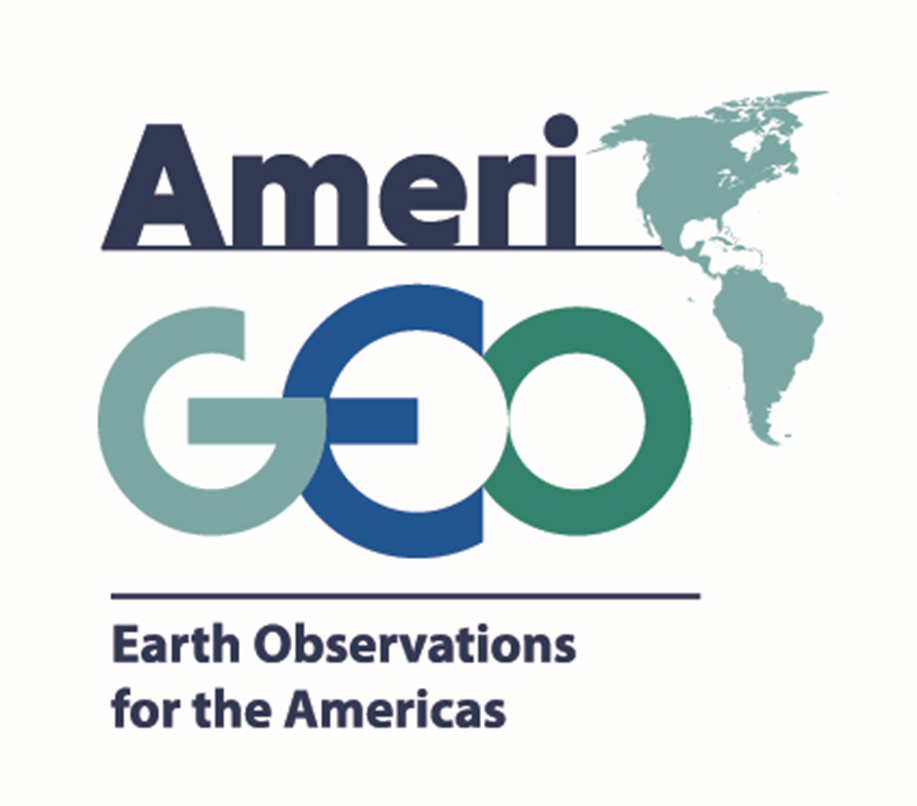
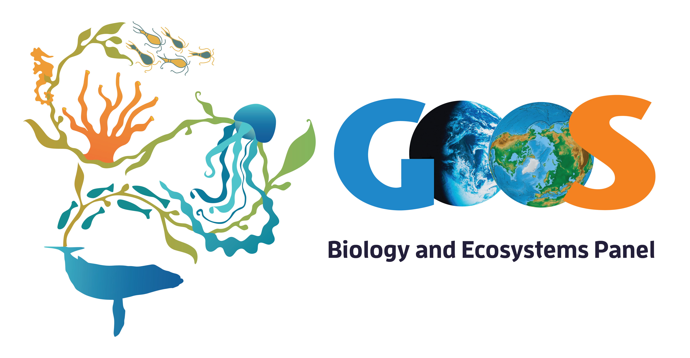

<br>
<br>
<font size="5"> 
The MBON Pole to Pole effort seeks to develop a framework for the collection, use and sharing of marine biodiversity data in a coordinated, standardized manner leveraging on existing infrastructure managed by the Global Ocean Observing System ([GOOS](http://www.goosocean.org/); IOC-UNESCO), the GEO Biodiversity Observation Network ([GEO BON](https://geobon.org/)), and the Ocean Biogeographic Information System ([OBIS](http://iobis.org/)). The MBON Pole to Pole aims to become a key resource for decision-making and management of living resource across countries in the Americas for reporting requirements under the Intergovernmental Science-Policy Platform on Biodiversity and Ecosystem Services (IPBES), Aichi Targets of the Convention of Biological Diversity (CBD), and the UN 2030 Agenda for Sustainable Development Goals (SDGs).
</font>
<br>
<br>
```{r setup, include=FALSE}
knitr::opts_chunk$set(echo = TRUE)
```
## People


<br>
<br>
The MBON Pole to Pole team at the [**Marine Biodiversity Workshop: from the Sea to the Cloud**](https://marinebon.github.io/p2p-brazil-workshop/), in São Sebastião, Brazil, 2018-08-06.
<br>
<br>
<br>
<br>

<br>
<br>
The MBON Pole to Pole team at the [**2nd Marine Biodiversity Workshop: from the Sea to the Cloud**](https://marinebon.github.io/p2p-mexico-workshop/), in Puerto Morelos, Mexico, 2019-04-05.
<br>
<br>
<br>
<br>

## Sponsors
<br>
<br>

<br>
<br>
<br>
<br>

<br>
<br>
<br>
<br>

<br>
<br>

<br>
<br>

<br>
<br>
<br>
<br>


