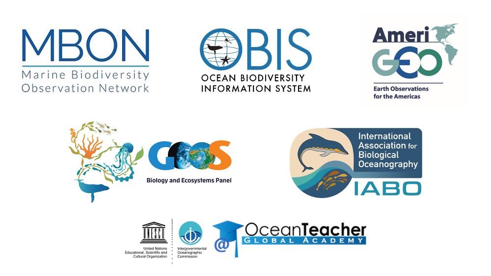
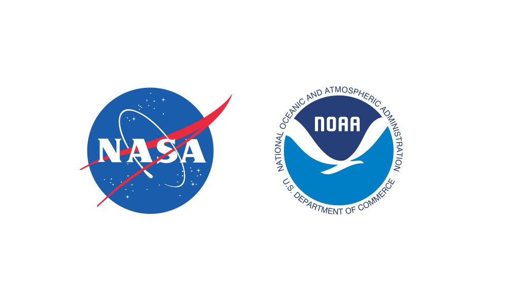

<br>
<br>
<font size="5"> 
The Marine Biodiversity Observation Network Pole to Pole of the Americas - MBON Pole to Pole - is a **Knowledge Sharing Network** dedicated to the collection, use and sharing of marine biodiversity data in a coordinated, standardized manner leveraging on existing infrastructure managed by the Global Ocean Observing System ([GOOS](http://www.goosocean.org/){target="_blank"}; IOC-UNESCO), the GEO Biodiversity Observation Network ([GEO BON](https://geobon.org/){target="_blank"}), and the Ocean Biodiversity Information System ([OBIS](http://iobis.org/){target="_blank"}). 

The MBON Pole to Pole aims to become a key resource for decision-making and management of living resources across countries in the Americas and support their reporting requirements of the Intergovernmental Science-Policy Platform on Biodiversity and Ecosystem Services ([IPBES](https://www.ipbes.net/){target="_blank"}), the [Post-2020 Global Biodiversity Framework](https://www.cbd.int/conferences/post2020){target="_blank"} of the Convention of Biological Diversity ([CBD](https://www.cbd.int/){target="_blank"}), and the UN 2030 Agenda for Sustainable Development Goals ([SDGs](https://www.un.org/sustainabledevelopment/development-agenda/){target="_blank"}).
</font>
<br>
<br>
```{r setup, include=FALSE}
knitr::opts_chunk$set(echo = TRUE)
```
## **People**


<br>
<br>
The MBON Pole to Pole team at the [**Marine Biodiversity Workshop: from the Sea to the Cloud**](https://marinebon.github.io/p2p-brazil-workshop/){target="_blank"}, in São Sebastião, Brazil, 2018-08-06.
<br>
<br>
<br>
<br>

<br>
<br>
The MBON Pole to Pole team at the [**2nd Marine Biodiversity Workshop: from the Sea to the Cloud**](https://marinebon.github.io/p2p-mexico-workshop/){target="_blank"}, in Puerto Morelos, Mexico, 2019-04-05.
<br>
<br>
<br>
<br>

## **Partner Organizations**
 

## **Sponsors**
 


