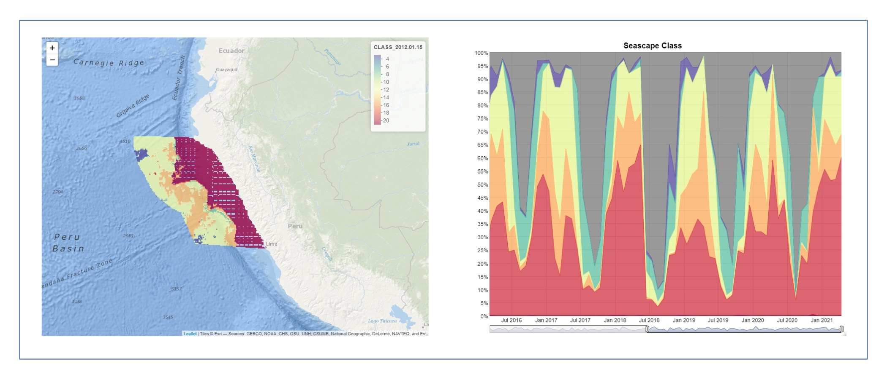
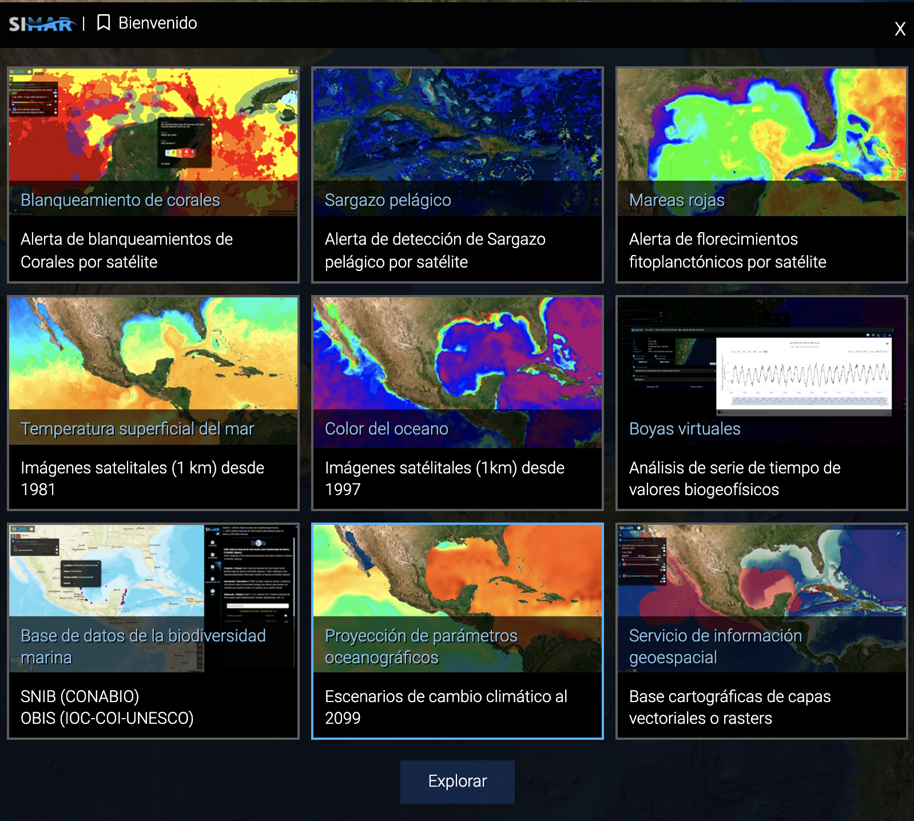

```{r setup, include=FALSE}
knitr::opts_chunk$set(echo = F, message = F, warning = F)
```

## Use the templates below to enter your survey data:

-   [**Rocky Shore Data Template -- NEW!**](https://github.com/diodon/P2P-templates/blob/main/RS_DataSheet_longformat_v1.3.xlsx){target="_blank"}
-   [**Sandy Beach Data Template -- NEW!**](https://github.com/diodon/P2P-templates/blob/main/SB_DataSheet_longformat_v1.3.xlsx){target="_blank"}

## Check your list of species with [WoRMS](http://www.marinespecies.org/aphia.php?p=webservice){target="_blank"} for taxonomy quality control:

-   [**Taxonomy quality check with WoRMS**](protocols/WoRMS_quality_check.pdf){target="_blank"}

## Transform your survey data tables to Darwin Core Archive files (DwC-A):

-   [**DwC-A Writer**](https://rpubs.com/eqmh/DwCA_Gen){target="_blank"}
-   [**Download this test dataset to run DwC-A Writer**](https://github.com/diodon/P2P-templates/blob/main/DataSheet_longformat_TEST_v2.xlsx){target="_blank"}

```{r, echo = F, message = F, warning = F}
if (!require(librarian)){
  install.packages("librarian")
  library(librarian)
}
shelf(vembedr)

embed_youtube("teJhfsSWonE", width = 910, height = 910*360/640, frameborder = 0,
  allowfullscreen = TRUE, query = NULL)
```

## Use these instructions to upload you data to the [MBON Pole to Pole IPT](http://ipt.iobis.org/mbon/){target="_blank"}:

-   [**HOW TO upload data to the Integrated Publishing Toolkit**](https://diodon.github.io/P2P_documents/PublishData/docs/PublishingDataIPT.html){target="_blank"}

## Filter and analyze in situ temperature logger records deployed on rock shores

-   **Use this [R script](https://marinebon.org/intertidal-temps/ingest.html){target="_blank"} to filter and visualize high-frequency temperature logger records for your monitoring sites** 

## Fetch, analyze, and visualize satellite seascape data from selected polygons

-   **Use the [seascapeR](https://marinebon.org/seascapeR/){target="_blank"} package to perform seascape analysis for your monitoring regions** 

## Create your biodiversity dashboard:

-   [**R script**](https://github.com/marinebon/p2p-dashboard){target="_blank"} **to develop [Biodiversity Dashboards](https://marinebon.org/p2p-dashboard/biodivExplorer_beach.html#general-information){target="_blank"} for your monitoring sites** 

## OBIS extractions:

-   [**R script**](http://rpubs.com/eqmh/lme-obis-extractions){target="_blank"} **to visualize boundaries of selected Large Marine Ecosystems (LMEs) and extract [OBIS](http://obis.org){target="_blank"} records from selected [LMEs](http://lme.edc.uri.edu/index.php/digital-data){target="_blank"}** 

## Extract satellite data:

-   [**R script**](https://rpubs.com/eqmh/sat-data-plotter-mapper){target="_blank"} **to extract sea surface temperature (SST) and chlorophyll-a (CHL) from [ERDDAP](https://coastwatch.pfeg.noaa.gov/erddap/index.html){target="_blank"} servers for selected locations, create time series plots of [SST](https://rpubs.com/eqmh/sst_ts_Patag){target="_blank"} and [CHL](https://rpubs.com/eqmh/chla_ts_Patag_v2){target="_blank"} and their [climatologies](https://rpubs.com/eqmh/sst_climatology_plot){target="_blank"}, and generate a map with the latest satellite data.** 

<br>
<br>

## Access the Marine-Coastal Information and Analysis System (SIMAR):

-   [Visit SIMAR](https://simar.conabio.gob.mx/){target="_blank"} of [CONABIO](https://www.gob.mx/conabio){target="_blank"} **to visualize and analyze satellite products for the Caribbean Sea, Gulf of Mexico and the Mexican and Central America Pacific.** 
