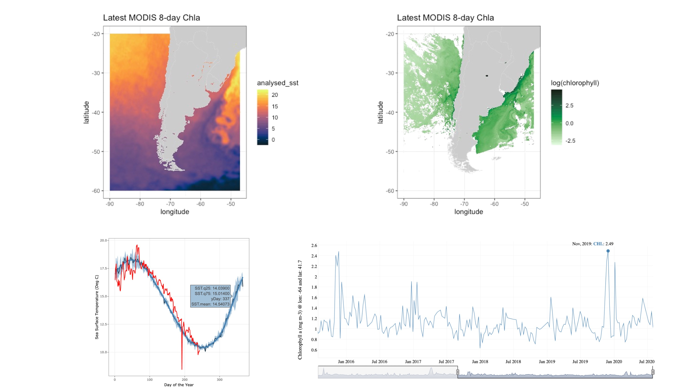

```{r setup, include=FALSE}
knitr::opts_chunk$set(echo = TRUE)
```
## Use the templates below to enter your survey data:
- [**Rocky Shore Data Template -- NEW!**](protocols/DataSheet_longformat_v1-2.xlsx)
- [**Sandy Beach Data Template**](protocols/Datasheet_template_SB.xlsx)

## Check your list of species with [WoRMS](http://www.marinespecies.org/aphia.php?p=webservice){target="_blank"} for taxonomy quality control:
- [**Taxonomy quality check with WoRMS**](protocols/WoRMS_quality_check.pdf){target="_blank"}

## Transform your survey data tables to Darwin Core Archive files (DwC-A):
- [**DwC-A Writer**](https://rpubs.com/eqmh/DwCA_Gen){target="_blank"}
- [**Download this test dataset to run DwC-A Writer**](protocols/DataSheet_longformat_TEST.xlsx)

## Use these instructions to upload you data to the [MBON Pole to Pole IPT](http://ipt.iobis.org/mbon/){target="_blank"}:
- [**HOW TO upload data to the Integrated Publishing Toolkit**](https://diodon.github.io/P2P_documents/PublishData/docs/PublishingDataIPT.html){target="_blank"}

## Create your biodiversity dashboard:
- [R script](https://github.com/marinebon/p2p-dashboard){target="_blank"} to develop [Biodiversity Dashboards](https://marinebon.org/p2p-dashboard/biodivExplorer_beach.html#general-information){target="_blank"} for your monitoring sites 


## OBIS extractions:
- [R script](http://rpubs.com/eqmh/lme-obis-extractions){target="_blank"} to visualize boundaries of selected Large Marine Ecosystems (LMEs) and extract [OBIS](http://obis.org){target="_blank"} records from selected [LMEs](http://lme.edc.uri.edu/index.php/digital-data){target="_blank"}


## Extract satellite data:
- [R script](https://rpubs.com/eqmh/sat-data-plotter-mapper){target="_blank"} to extract sea surface temperature (SST) and chlorophyll-a (CHL) from [ERDDAP](https://coastwatch.pfeg.noaa.gov/erddap/index.html){target="_blank"} servers for selected locations, create time series plots of [SST](https://rpubs.com/eqmh/sst_ts_Patag){target="_blank"} and [CHL](https://rpubs.com/eqmh/chla_ts_Patag_v2){target="_blank"} and their [climatologies](https://rpubs.com/eqmh/sst_climatology_plot){target="_blank"}, and generate a map with the latest satellite data.

