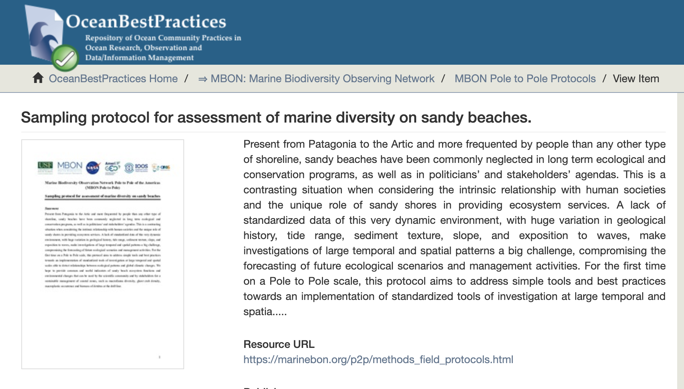

```{r setup, include=FALSE}
knitr::opts_chunk$set(echo = TRUE)
```
# Use standardized field protocols below to collect biodiversity observations in rocky intertidal areas and sandy beaches:<br> 
- [Rocky Shore](https://repository.oceanbestpractices.org/handle/11329/1143){target="_blank"}  Included on the [OBPS](https://search.oceanbestpractices.org/){target="_blank"} 
<br>
<br>

<br>
<br>
<br>
- [Sandy Beach](https://repository.oceanbestpractices.org/handle/11329/1145){target="_blank"} Included on the [OBPS](https://search.oceanbestpractices.org/){target="_blank"}
<br>
<br>


# Use the template below to register observations collected in sandy beach surveys:
- [Sandy Beach Field Logsheet](protocols/FieldForm_SandyBeach.xlsx) NEW!

